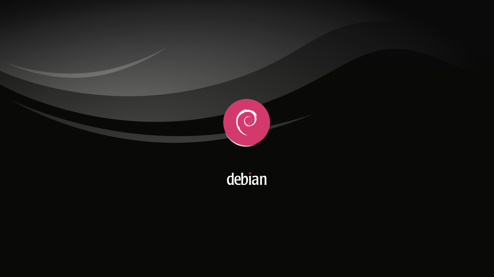

# dark_deb
Debian's dark &amp; classic colors plymouth theme

# THIS THEME IS A FORK!

This theme have forks from other projects

Background forked from Alex Makas https://wiki.debian.org/DebianArt/Themes/gradientMotion

General theme forked from https://github.com/realmazharhussain/plymouth-theme-softwaves-manjaro

# INSTALLATION:
You can install using the next commands on your terminal

 git clone https://github.com/David-Castro16/dark_deb.git
 
 sudo cp -r dark_deb/ /usr/share/plymouth/themes/
 
 sudo plymouth-set-default-theme -R dark_deb
 
# License
 This theme is licensed under GPLv3, for more details check LICENSE.
